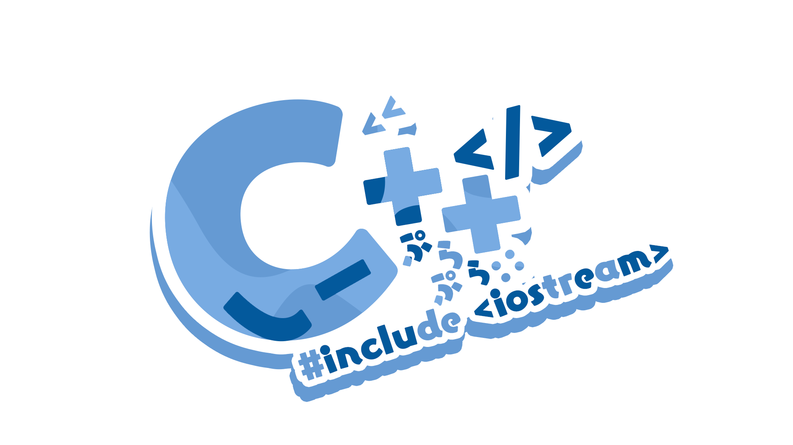
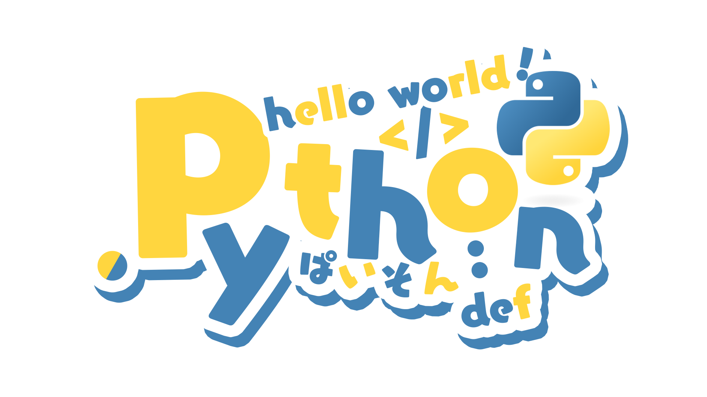
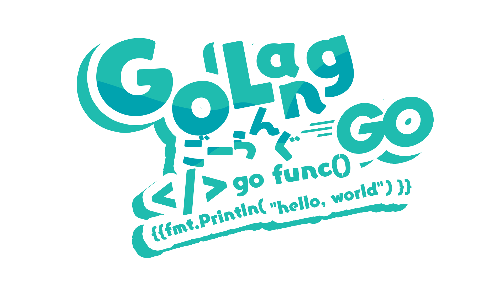
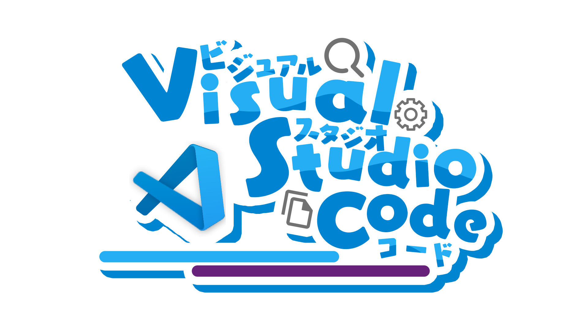
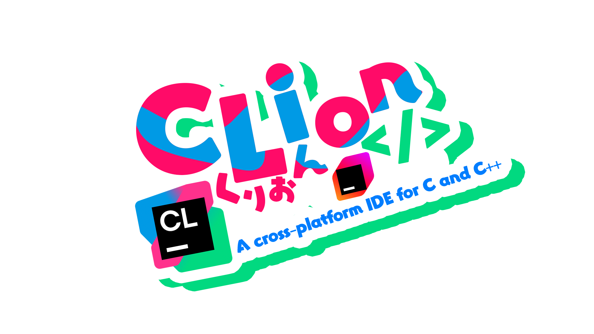

## 💻 你的桂-师-傅的主页 (Masters_Gui's Homepage) 👋

  

### ✨ 我的 GitHub 统计数据

  
  

### 👤 个人简介 (About Me)

我是一位**模拟飞行爱好者**和**编程“达人”**。我主要在以下组织中活跃：

* **Master Gui Studio** (@ [Master Gui Studio](https://github.com/Master-Gui-Studio))

> 📜 **开源项目提示:**
> 我们有很多开源项目，但也有非常多的**非开源项目**。请留意文件夹内部是否有 `LICENSE` 文件来确定其开源状态。

如果项目对您有所帮助，请不吝给一个 **Star**！⭐

### 🛠️ 使用语言与技能 (Languages & Skills)

| 语言 | 熟练度描述 | 图标 |
| :--- | :--- | :--- |
| **C++** | 正在学习中 |  |
| **HTML/Markdown** | 无需学习，`Ctrl+C` `Ctrl+V` (精通CV大法) |  |
| **Python** | 洒洒水啦，简单做个爬虫还阔以 |  |
| **Go** (Golang) | 看得懂，但不会写 |  |

### 🗄️ 开发软件清单 (Software Stack)

| 软件名 | 用途 | 图标 |
| :--- | :--- | :--- |
| **VSCode** | Vue 项目 / 轻量 Python 项目 |  |
| **Visual Studio 2022** | EuroScope Plugin 开发 |  |
| **Obsidian**, **Typora** | Markdown 文档撰写 |  |
| **PyCharm** | 日常 Python 项目及部分 Markdown 编辑 |  |
| **CLion** | 部分 C++ 竞赛项目 |  |

> *🌟 特别感谢 @ [SAWARATSUKI](https://github.com/SAWARATSUKI) 制作的可爱 Logo！Thank you! ありがとう！*

### 🏆 竞赛经历 (Competitions)

* **2024 VEX IQ Robotics Competition World**
    * Team: `7755B` (Without dome)
    * Result: [Spirit Award](https://www.robotevents.com/robot-competitions/vex-iq-competition/RE-VIQRC-23-3693.html#spirit)
* **NOIP** (@ [noi.cn](https://www.noi.cn/)) - 三等奖 (Third Prize)
* **蓝桥杯青少年组** (@ [lanqiaoqingshao](https://www.lanqiaoqingshao.cn/home)) - 二等奖 (Second Prize)

### 🛡️ 账户安全与签名 (Account Security)

  

* **GPG 密钥 1**: `F5D4CF689AED7FF6`
    * 到期时间: `2028/11/16`
* **GPG 密钥 2**: `D92563A99257DCB9`
    * 到期时间: `undefined`

> ⚠️ **重要提醒:**
> 已开启 Github [警戒模式](https://docs.github.com/zh/authentication/managing-commit-signature-verification/displaying-verification-statuses-for-all-of-your-commits)。如果您遇到本人使用**非此密钥**进行提交，请及时进行汇报！

### 📧 联系方式 (Contact Me)

| 平台 | 账户/链接 |
| :--- | :--- |
| **Github** | @ [supermastergui](https://github.com/supermastergui) |
| **Email** | [gui.shifu@outlook.com](mailto:gui.shifu@outlook.com) |
| **QQ Chat** | `1436001938` |
